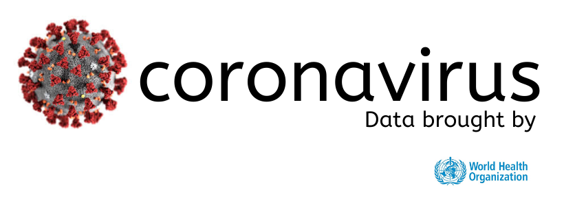

<p align="center">
  
</p>

[travis-image]: https://api.travis-ci.org/nestjs/nest.svg?branch=master
[travis-url]: https://travis-ci.org/nestjs/nest
[linux-image]: https://img.shields.io/travis/nestjs/nest/master.svg?label=linux
[linux-url]: https://travis-ci.org/nestjs/nest
  
  <p align="center">This GraphQL API provides updated real-time data on coronavirus cases from the worldometers page and other important websites, provided by the most reputable organizations and statistical offices in the world.</p>
    <p align="center">

          


## 🚨 Project in premature state 🚨
Project started, and in development process. More information in the next days / weeks.


## 📖 Documentation


## Data Queries From Puerto Rico
 


### Medical Data
- [x] **PRMedicalAidDistribution**

```graphql
query{
  PRMedicalAidDistribution{
    recipient_Name 
    city
    county
    state
    first_shipment
    last_shipment
    weight_lbs
    country
    facility_type
    number_of_deliveries
    cost
  }
}
```

### Biosecurity
- [x] **PRDataByTowns**

```graphql
query{
  PRDataByTowns{
    table{
      attributes{
        town
        health_region
        total_cases
      }
    }
  }
}
```

- [x] **HospitalDataAndNeeds**
```graphql
query{
  PRHospitalDataAndNeeds{
    table{
      attributes{
        T_Camas_Adult_Disp
        T_Camas_Adult_Int_Disp
        T_Camas_Adult_Int_Occ
        T_Camas_Ped_Int_Disp 
        T_Camas_Ped_Int_Occ
        T_Cuartos_PSINeg_Disp
        T_Cuartos_PSINeg_Occ
        T_Vent_Adult_Disp
        T_Vent_Adult_Occ
        T_Vent_Ped_Disp
        T_Vent_Ped_Occ
        T_Morgue_Disp
        T_Morgue_Occ
        // ......
      }
    }
  }
}
```


##  **Donations**
COVID19 GraphQL API is an open source project licensed by MIT with continuous development. If you want me to continue maintaining this library and you are interested in continuing to use it, you can help me with a monetary help in the following link:


- [One-time donation via PayPal.](https://paypal.me/chrismperezsantiago?locale.x=en_US)

<a href="https://www.buymeacoffee.com/chrismichael" target="_blank"></a>

These are projects that take a lot of effort and time to maintain. So with your help I will be more motivated to continue maintaining the COVID19 API project.

## **:handshake: Contributing**

- Fork it!
- Create your feature branch: `git checkout -b my-new-feature`
- Commit your changes: `git commit -am 'Add some feature'`
- Push to the branch: `git push origin my-new-feature`
- Submit a pull request

---

### **:busts_in_silhouette: Credits**

- [Chris Michael](https://github.com/ChrisMichaelPerezSantiago) (Project Leader, and Developer)

---

### **:anger: Troubleshootings**

This is just a personal project created for study / demonstration purpose and to simplify my working life, it may or may
not be a good fit for your project(s).

---

### **:heart: Show your support**

Please :star: this repository if you like it or this project helped you!\
Feel free to open issues or submit pull-requests to help me improving my work.


---


### **:robot: Author**

_*Chris Michael*_

> You can follow me on
[github](https://github.com/ChrisMichaelPerezSantiago)&nbsp;&middot;&nbsp;[twitter](https://twitter.com/Chris5855M)

---

Copyright © 2020 [COVID19 GraphQL API](https://github.com/ChrisMichaelPerezSantiago/covid19-gql).
